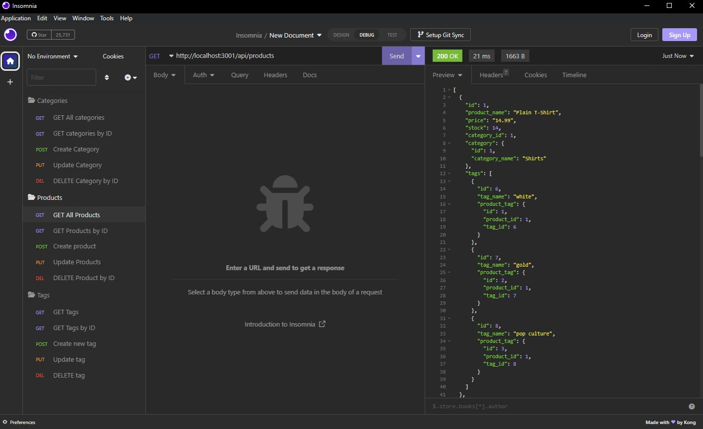

# E-commerce-Back-End

## Content

* [Project Overview](#project-overview)
* [Technology](#technology)
* [Installation](#installation)
* [Video](#video)
* [License](#license)
* [Screenshots](#screenshots)

## Project Overview

 E-commerce back end application run using MySQL database and Sequelize and Express Node.js packages. Data is hosted across four different tables that related using Sequelize associations and foreign keys. Express is used to access, create and remove data using AJAX get, post, put and delete requests.

 ## Technology
* JavaScript (Node.js)
* SQL (mySQL)
* [mySQL](https://www.npmjs.com/package/mysql)
* [Sequelize](https://www.npmjs.com/package/sequelize)
* [Express](https://www.npmjs.com/package/express)
* [Dotenv](https://www.npmjs.com/package/dotenv)

## Installation

Clone the code from GitHub, the application required the installation Node.js, run the command "npm i in command line to install the packages. 

Then, update [.env](./.env) to hold your specific SQL credentials and database information so that the server.js file can connect to the server and update file name to .env. 

 Next, seed the data by running command "npm run seed" in command line to add test data to the database. You should now be ready to launch the application by running command "npm start."

## Video

[Video link](https://drive.google.com/file/d/1lZv3O0ATFvHDAcd4KJ7zkgJmcB8YpRBv/view?usp=share_link) 

## License

Copyright (c) 2022 SerhiyZv

Permission is hereby granted, free of charge, to any person obtaining a copy
of this software and associated documentation files (the "Software"), to deal
in the Software without restriction, including without limitation the rights
to use, copy, modify, merge, publish, distribute, sublicense, and/or sell
copies of the Software, and to permit persons to whom the Software is
furnished to do so, subject to the following conditions:

The above copyright notice and this permission notice shall be included in all
copies or substantial portions of the Software.

THE SOFTWARE IS PROVIDED "AS IS", WITHOUT WARRANTY OF ANY KIND, EXPRESS OR
IMPLIED, INCLUDING BUT NOT LIMITED TO THE WARRANTIES OF MERCHANTABILITY,
FITNESS FOR A PARTICULAR PURPOSE AND NONINFRINGEMENT. IN NO EVENT SHALL THE
AUTHORS OR COPYRIGHT HOLDERS BE LIABLE FOR ANY CLAIM, DAMAGES OR OTHER
LIABILITY, WHETHER IN AN ACTION OF CONTRACT, TORT OR OTHERWISE, ARISING FROM,
OUT OF OR IN CONNECTION WITH THE SOFTWARE OR THE USE OR OTHER DEALINGS IN THE
SOFTWARE.

## Screenshots

